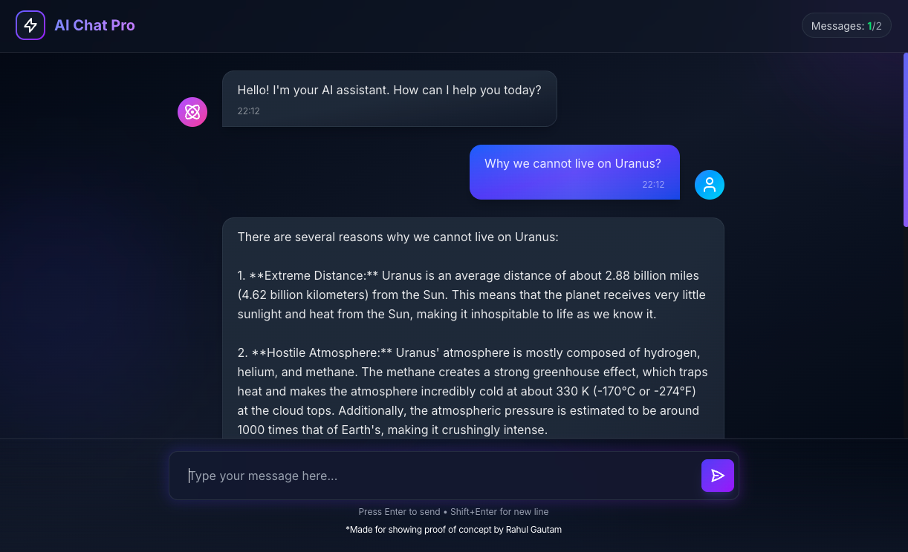
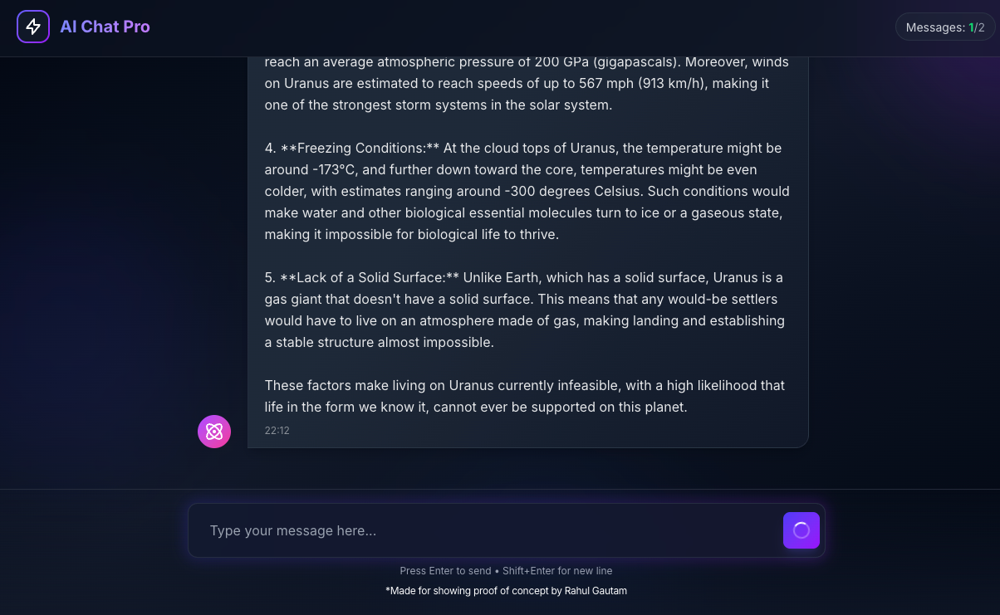
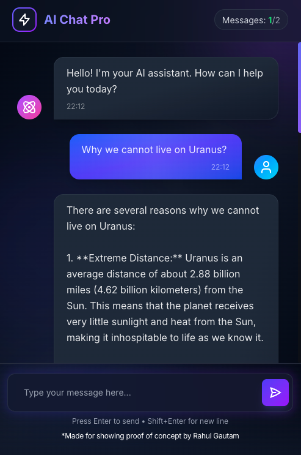

<div align="center">

# ✨ AI Chat Pro — Ultra-Fast AI Chat Interface Powered by Groq

### **Blazing-Fast, Minimal & Production-Ready AI Chat Experience**

[](https://ai-chat-pro-fast.vercel.app/)
[](#)


**Ultra-Low Latency · Clean UI · Developer-First SaaS**

</div>

---

## 🌈 Project Overview

**AI Chat Pro** is a **modern, single-page AI chat application** built for **speed, clarity, and performance**.  
Powered by **Groq AI**, it delivers **near-instant responses** with a clean, premium chat experience that feels like a finished product — not a demo.

Designed for **real users, real conversations, and real-world usage**.

---

## 🚀 Why AI Chat Pro?

- ⚡ **Ultra-Fast AI Responses** using Groq’s high-performance inference
- 🧠 **Context-Aware Conversations**
- 🎨 **Premium Chat UI** with modern spacing, gradients & bubbles
- 📱 **Fully Responsive** across devices
- 🧩 **Single-Page Experience** for focused interaction
- 🛠️ **Clean, Maintainable Codebase**

---

## 🧠 Core Features

- 💬 Real-time AI chat interface
- 🚀 Groq AI integration for low-latency replies
- 🎯 Distinct user & AI chat bubbles
- 🎨 Beautiful header & branding
- 🌓 Smooth gradients & spacing
- 📜 Auto-scrolling conversation flow
- 🧼 Minimal, distraction-free layout

---

## 🏗️ Tech Stack

| Layer         | Technology             |
| ------------- | ---------------------- |
| **Framework** | Next.js (App Router)   |
| **UI**        | React                  |
| **Language**  | TypeScript, JavaScript |
| **AI**        | Groq AI                |
| **Styling**   | Tailwind CSS           |

---

## 📸 Product Preview

<div align="center">

### **Chat Screen**

<!-- Replace with your screenshot -->


---

### **Live AI Conversation**

<!-- Replace with your screenshot -->


---

### **Responsive Mobile UI**

<!-- Replace with your screenshot -->


---


> **“Feels like a real product, not a prototype.”**

- Proper spacing, padding & margins
- Clear visual hierarchy
- Polished chat bubbles
- Clean typography
- Smooth user experience

---

## 🔮 Future Enhancements

- 🔐 User authentication
- 🗂️ Persistent chat history
- 🧠 Model selection
- 🌓 Dark / light mode
- 📤 Export conversations
- ⚙️ Advanced system prompts

---

## 🧑‍💻 Perfect For

- Developers exploring **Groq AI**
- AI SaaS UI inspiration
- Portfolio & Upwork projects
- Hackathons & MVPs
- Product-grade demos

---

## 📄 License

This project is **open-source** and free to use for learning, customization, and inspiration.

---

<div align="center">

### ⭐ Like this project? Star it and follow for more!

</div>
```
